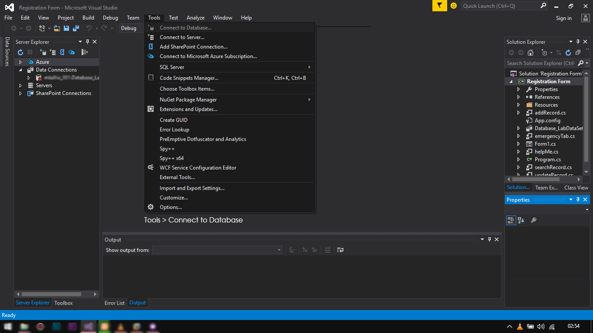
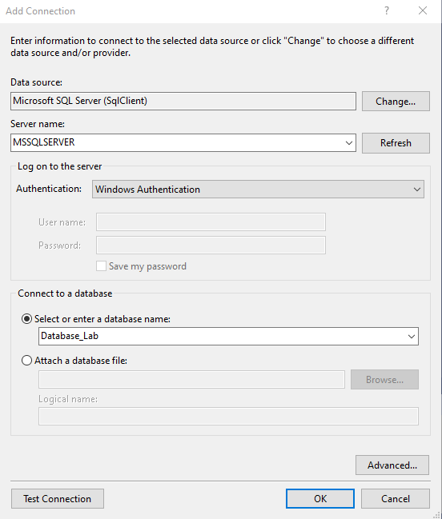
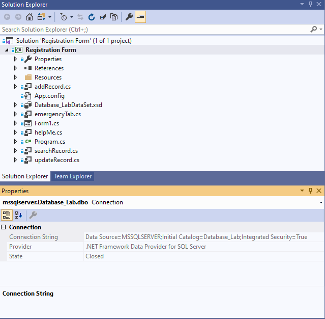
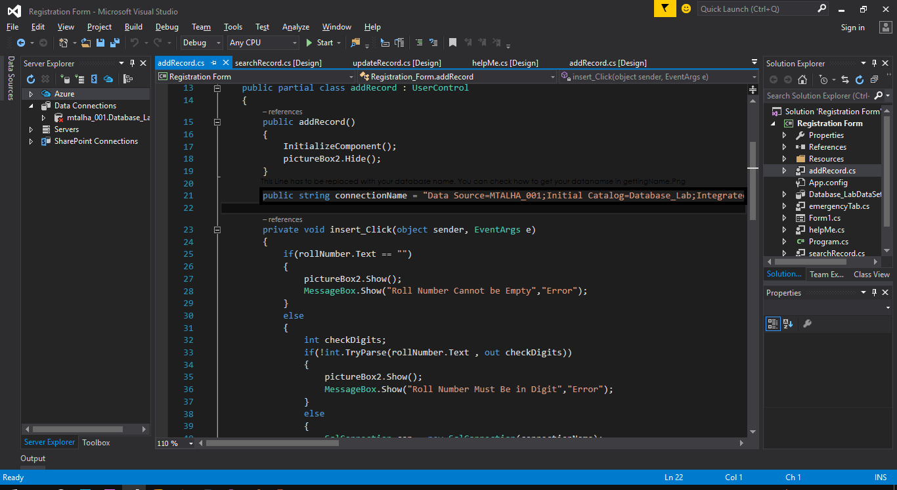
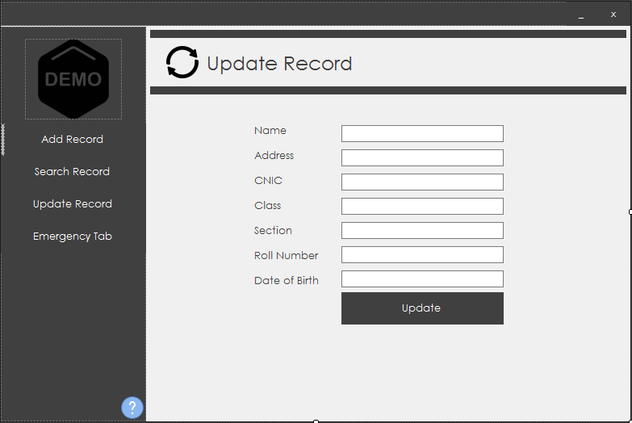
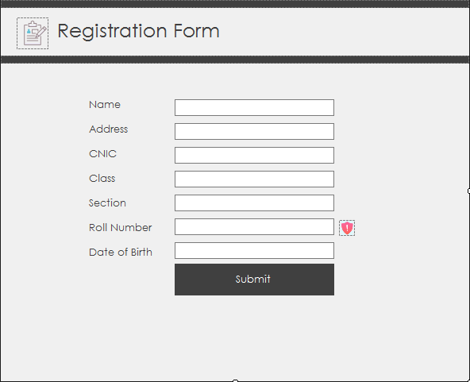
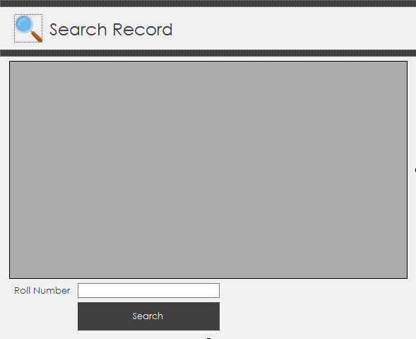
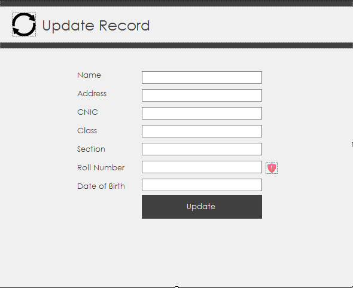
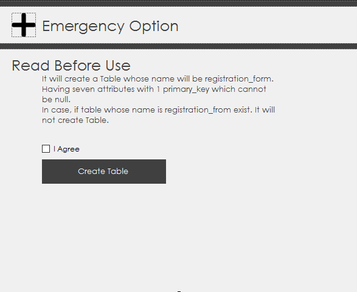
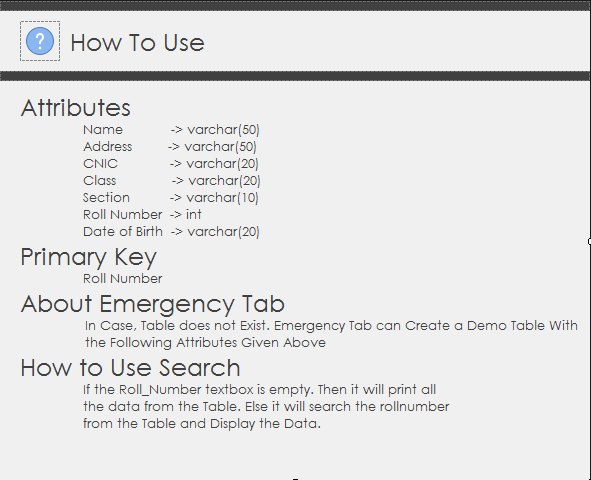

# How To Setup This Project? 
 Minimum Visual Studio 15 is Required to run this Project. This Project is Created in Visual Studio 15 using C# as Front-End and Designing and SQL Server as Backend. This Project is Window Based. So this Project only runs in windows. Simple Flat UI Based with Moveable Borderless Form.

# Attributes Used
 ------------------------------------------------------------------------
 Sr) Attribute Name  -> Variable Name (C# TextBox) -> SQL Attribute Name
 ------------------------------------------------------------------------
 1)  Name            -> name                       -> Name          = varchar(50)
 2)  Address         -> address                    -> Address       = varchar(50)
 3)  CNIC            -> cnic                       -> CNIC          = varchar(20)
 4)  Class           -> className                  -> Class         = varchar(20)
 5)  Section         -> section                    -> Section       = varchar(10)
 6)  Roll Number     -> rollNumber                 -> Roll Number   = int
 7)  Date of Birth   -> dateOfBirth                -> Date of Birth = varchar(20)
 ------------------------------------------------------------------------
 
# Use Of Emergency Tab
 In case registration_form Table is not existed in the given Database. It case Create a Table in your Database name as registration_form.

# How To Setup 
 Connect To Database
  Tools > Connect To Database 
  
 
 TestConnection
  Select Server Name > Then Select Your Database Name > Press Test Connection to Test your Connection with your Database. 

  
 
 Getting Your SQL Server Name 
  Press On Data Connections on the leftSide and Go To Properties and Copy ConnectionString 

  
 
 Replace Name With Your Database 
 Replace This line : 
  public string connectionName = "Data Source=MSSQLSERVER;Initial Catalog=Database_Lab;Integrated Security=True"; 
  In (addRecord.cs, searchRecord.cs, updateRecord.cs, emgergencyTab.cs) 
  
  
 
# Demo Screenshot
 Form1 
 
  
 AddRecord 
 
  
 SearchRecord 
 
  
 UpdateRecord 
 
  
 EmergencyTab 
 
  
 Help 
 
  
 
